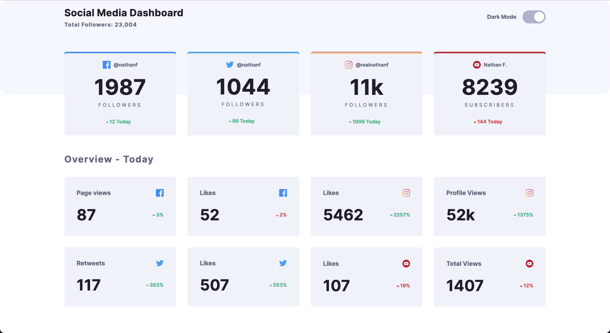

# Frontend Mentor - Social media dashboard with theme switcher solution

This is a solution to the [Social media dashboard with theme switcher challenge](https://www.frontendmentor.io/challenges/social-media-dashboard-with-theme-switcher-6oY8ozp_H) on Frontend Mentor

## Table of contents

-  [Overview](#overview)
   -  [The challenge](#the-challenge)
   -  [Screenshot](#screenshot)
   -  [Links](#links)
-  [My process](#my-process)
   -  [Built with](#built-with)
   -  [What I learned](#what-i-learned)
   -  [Continued development](#continued-development)
   -  [Useful resources](#useful-resources)
-  [Author](#author)

## Overview

### The challenge

Your users should be able to:

-  View the optimal layout for the site depending on their device's screen size
-  See hover states for all interactive elements on the page
-  Toggle color theme to their preference

### Screenshot



### Links

-  Live Site URL:

## My process

### Built with

-  Semantic HTML5 markup
-  Flexbox
-  CSS Grid
-  Mobile-first workflow
-  Vanilla JS

### What I learned

```html
<label class="switch">
   <input type="checkbox" id="dark-mode" class="checkbox-dark-mode" />
   <span class="slider round"></span>
</label>
```

```css
:root {
   background-image: linear-gradient(
      to bottom,
      hsl(225, 100%, 98%) 270px,
      hsl(0, 0%, 100%) 270px
   );
}

/* 1st attempt at bg-color change */

.bg-grey {
   position: absolute;
   z-index: -1;
}

/* final solution */

input:checked + .slider {
   background-image: linear-gradient(hsl(210, 78%, 56%), hsl(146, 68%, 55%));
}

/* theme toggle  */
```

```js
themeSwitch.addEventListener('change', (e) => {
   if (e.target.matches('#dark-mode')) {
      root.classList.toggle('html-dark')
      ...
   }
```

### Continued development

More accessible theme toggles + more functional implementations

Beyond traditional 'for' loops - diff types (for...of) - more readable

### Useful resources

-  [Toggle Switch - Codepen](https://codepen.io/haleonearth/pen/aJMevP) - This helped me tremendously with the styles and logic of a theme switcher toggle, especially since I hadn't created one before this project.

## Author

-  Website - [Joshua Jameson-Wallis](https://joshuajamesonwallis.com)
-  Linkedin - [Joshua Jameson-Wallis]()

###### TODO

HTML:

Building header content to dynamically fit mobile + wider layout (planning it out - rendering hr hidden)

CSS:

Bg img on top-half of body - 1st attempt gradient which changed at that point | final solution - negative z-index positioned div

Theme toggle - 1st use in project | wrapping in parent label (clickable link) + pseudo-els to create slider | into to translating property in CSS (going back + forth due to checked state being true or false - not flying off side) | using that logic nicely in JS to change colours

Responsive Grid - pseduo-els to fill appropaite grid cells when allowing to be repsonsive with auto-fill/fit | future - grid-areas + template controlled layout = column - two col - 3+ (no need) | pseudo els fill 1st + last grid cell on container - power of grid

scale() - 1st use | transition opacity on hover - nice effect

Pseudo els for arrows next to numbers - fluid horizontal values vs fixed vertical (understanding why that's common)

Testing, testing, testing

Testing, testing, testing
